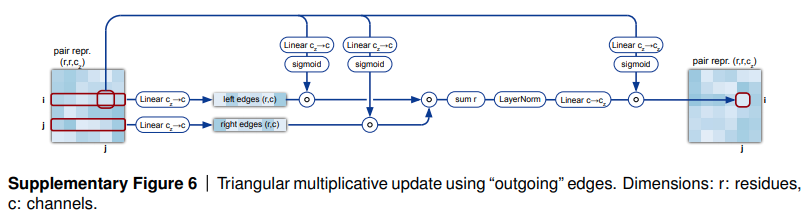

# Description

For a more complete description, see: https://tinyurl.com/gpumode-trimul You will be implementing a Triangle Multiplicative Update (TriMul) module that is a core operation for AlphaFold3, Chai, Protenix, and other protein structure prediction models in BioML.

The TriMul operator operates over a 4D tensor of shape [B, N, N, C].

Your task:

- Implement the "outgoing" version of the TriMul operator from the AlphaFold3 paper.
- You will not have to compute or store gradients for this version. You will only need to implement the forward pass.
Input:

- data: Tuple of (input: torch.Tensor, weights: Dict[str, torch.Tensor], config: Dict)
    - input: Input tensor of shape [bs, seq_len, seq_len, dim]
    - mask: Mask tensor of shape [bs, seq_len, seq_len]
    - weights: Dictionary containing model weights
    - config: Dictionary containing model configuration parameters

Output:

- Tuple containing:
    - output: Processed tensor [bs, seq_len, seq_len, dim]

Here is a more detailed description 

### **Introduction and Motivation**

*“This is a really really fun + impactful problem for kernel devs. good luck :p” — az* 

A lot of the kernels / problems you will see in these GPU MODE kernel writing competitions center around large language model training — our last competition, for example, centered around popular single-device kernels used in DeepSeek-V3/R1. Many future problems may also revolve around communication kernels where we provide a whole node such as the expert parallelism MoE. 

Many of these kernels we have in mind have already been heavily optimized by experts in labs like DeepSeek, OpenAI, Anthropic, Google DeepMind, etc. so we wanted to design some problems that were still interesting, but had real use cases when solved. The first problem that immediately came to mind was the **Triangle Multiplicative Update** used in AlphaFold2 and AlphaFold3, a series of extremely influential works in the BioML space that led to [**John Jumper and Demis Hassabis winning the Nobel Prize in Chemistry**](https://www.nobelprize.org/prizes/chemistry/2024/press-release/). This operator is particularly nasty due to its cubic $O(n^3)$ operations. The peak memory of this operator is so bad that most implementations of AlphaFold3 (see [**Ligo’s OSS reproduction](https://github.com/Ligo-Biosciences/AlphaFold3)** and MIT’s [**Boltz-2**](https://github.com/jwohlwend/boltz)) keep the batch size during training at 1, despite the models being <1B in parameter size!

***Edit.** Funnily enough, while writing up this problem, we noticed that NVIDIA actually released that they had been working on this kernel in their cuEquivariance library — what a coincidence! We ask that participants do not use this library in their solutions, as it is closed source (we will be automatically and manually removing these solutions on the leaderboard). Honestly though, I’m confident that you all can easily beat their solution!*

Now enough motivation, it’s time to **get coding**!

<aside>
**Problem Statement: Outgoing TriMul Kernel**

In this problem, you will be working with pairwise sequence of embeddings, which is nastier than a sequence of embeddings used for language models. Your tensor will have a (small) batch size, two sequence dimensions (of equal size), and a hidden dimension. Here is a visual diagram of what is going on for batch size=1, taken from the AlphaFold3 supplementary:



Basically, your input tensor will be split into two paths (through the same transformation just with different weights). These paths get transformed in pretty simple ways (a LayerNorm, a sigmoid, and some linear transformations) until finally they are combined using the “triangle multiplication” operator, which is basically just a batched matrix multiplication where the batch dimension is actually the sequence dimension (see Line 4 below).

**Remark.** The operator itself seems quite simple, but you’ll notice that there’s a lot of really nasty parts of this algorithm. Namely, using tensor cores / matrix cores is non-trivial because you need everything to be contiguous along a certain dimension. The tensors are provided to you in `LayoutRight` stride, i.e. contiguous along the channel dimension.

### **Formal specification:**

Given a tensor $\bold{Z} \in \mathbb{R}^{B \times N \times N \times c_z}$, compute $\bold{\tilde{Z}} \in \mathbb{R}^{B \times N \times N \times c_z}$ based on the expressions below (where $B$ is the batch dimension, so it’s ignored in the notation below), where the **LayerNorm** and **LinearNoBias** (just a weight matrix) act over the channel dimension.


**Code Version:**

```python
# From https://github.com/lucidrains/triangle-multiplicative-module/blob/main/triangle_multiplicative_module/triangle_multiplicative_module.py
class TriMul(nn.Module):
    def __init__(
        self,
        dim: int,
        hidden_dim: int,
    ):
        super().__init__()

        self.norm = nn.LayerNorm(dim)

        self.left_proj = nn.Linear(dim, hidden_dim)
        self.right_proj = nn.Linear(dim, hidden_dim)

        self.left_gate = nn.Linear(dim, hidden_dim)
        self.right_gate = nn.Linear(dim, hidden_dim)
        self.out_gate = nn.Linear(dim, hidden_dim)

        self.to_out_norm = nn.LayerNorm(hidden_dim)
        self.to_out = nn.Linear(hidden_dim, dim)

    def forward(self, x: torch.Tensor, mask: torch.Tensor) -> torch.Tensor:
        """
        x: [bs, seq_len, seq_len, dim]
        mask: [bs, seq_len, seq_len]

        Returns:
            output: [bs, seq_len, seq_len, dim]
        """
        batch_size, seq_len, _, dim = x.shape

        x = self.norm(x)
				
				# Compute left and right paths
        left = self.left_proj(x)
        right = self.right_proj(x)

        mask = mask.unsqueeze(-1)
        left = left * mask
        right = right * mask

        left_gate = self.left_gate(x).sigmoid()
        right_gate = self.right_gate(x).sigmoid()
        out_gate = self.out_gate(x).sigmoid()

        left = left * left_gate
        right = right * right_gate

        # This is what youre computing: 
        # out = einsum('... i k d, ... j k d -> ... i j d', left, right)
        out = torch.zeros(batch_size, seq_len, seq_len, dim, device=x.device)
        
        # Compute using nested loops
        for b in range(batch_size):
            for i in range(seq_len):
                for j in range(seq_len):
                    # Compute each output element
                    for k in range(seq_len):
                        out[b, i, j] += left[b, i, k, :] * right[b, j, k, :]
				
				# Final output transformations
        out = self.to_out_norm(out)
        out = out * out_gate
        return self.to_out(out)
```

**Problem Constraints:**

- $B \in {1,2}, N \in {128,256,512,1024}, c \in {128}, c_{z} \in {\{128,384,768\}}$
- The input distribution will be sampled from a standard Normal distribution, or a heavy-tailed Cauchy distribution ( $\gamma=2$ ).
- There will either by no mask, or a randomly sampled mask over the inputs.
- Using the NVIDIA cuEquivariance library is not permitted! Your solution will be removed from the leaderboard if it uses it in any way.

**Remarks.** So why is this problem so annoying? Because you have to choose whether to load / deal with either the channel dimensions $c,c_z$ that the LayerNorms require (otherwise you have to do a synchronize to compute the statistics like mean / variance) or the sequence dimension $N$. The sequence dimension is particularly annoying because it’s quite large, but also because we compute pair-wise operations at the last operation that sum over another sequence dimension (this is $N^3$!). However, I really like this kernel because it only consists of “simple” operations, and is really easy to understand. It is a true test of “fusions” that torch.compile() doesn’t do that well.

**Some GitHub references of AF3 / TriMul kernels if you’re interested:**

https://github.com/lucidrains/triangle-multiplicative-module

https://github.com/jwohlwend/boltz

https://github.com/chaidiscovery/chai-lab

https://github.com/NVIDIA/cuEquivariance/commit/87a1ddb9fe79469a0562ce1895bdf461efc660f4

</aside>