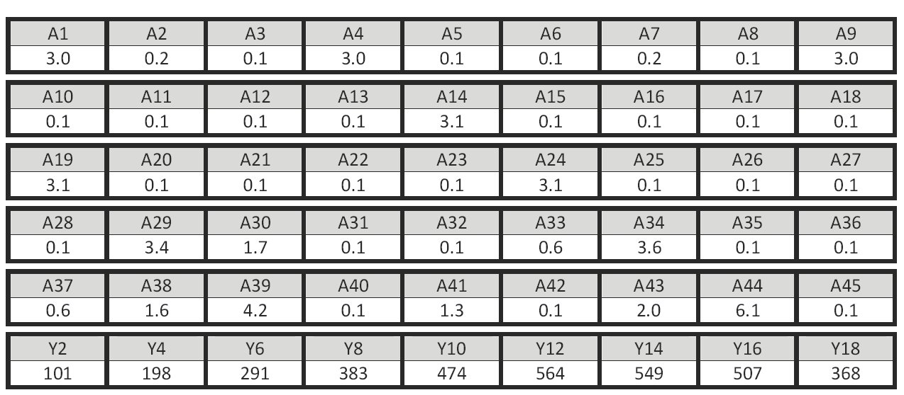
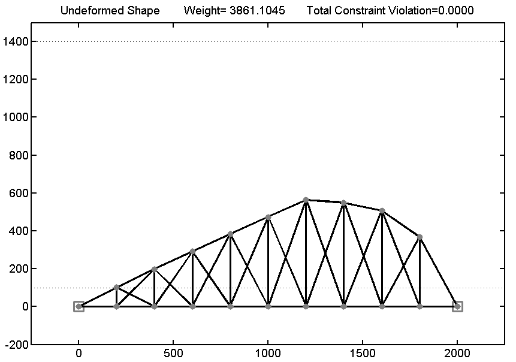

Optimum Solution Reported by Team COME
The optimum values for the sizing and shape variables reported by Team COME are given in the following table. The reported numerical values can be downloaded from this link. The final geometry of the given truss structure is also depicted in the following figure. The reported optimum weight is 3861.1045 lb.

